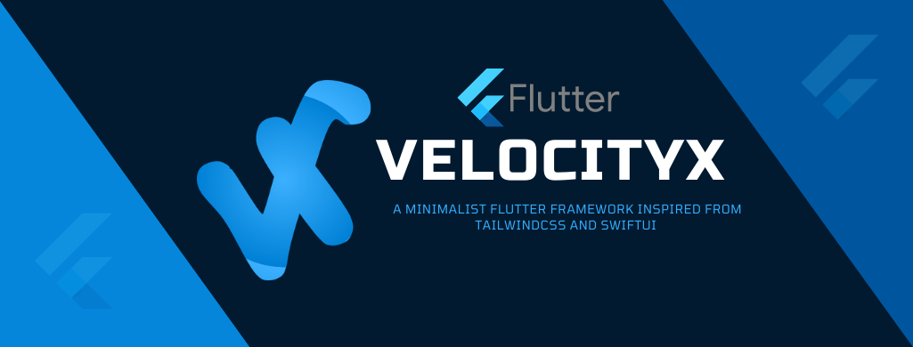

# flutter_music

A new Flutter application.

Api: https://developer.spotify.com/

## Getting Started

This project is a starting point for a Flutter application.

A few resources to get you started if this is your first Flutter project:

- [Lab: Write your first Flutter app](https://flutter.dev/docs/get-started/codelab)
- [Cookbook: Useful Flutter samples](https://flutter.dev/docs/cookbook)

For help getting started with Flutter, view our
[online documentation](https://flutter.dev/docs), which offers tutorials,
samples, guidance on mobile development, and a full API reference.

## MobX for Dart and Flutter
Introduction
MobX is a state-management library that makes it simple to connect the reactive data of your application with the UI (or any observer). 
This wiring is completely automatic and feels very natural. As the application-developer, 
    you focus purely on what reactive-data needs to be consumed in the UI (and elsewhere) without worrying about keeping the two in sync.

It's not really magic but it does have some smarts around what is being consumed (observables) and where (reactions), and automatically tracks it for you. 
When the observables change, all reactions are re-run. What's interesting is that these reactions can be anything from a simple console log, 
    a network call to re-rendering the UI.
    
[online documentation](https://mobx.netlify.app/)

## VelocityX

VelocityX is a 100% free Flutter open-source minimalist UI Framework built with Flutter SDK to make Flutter development easier and more joyful than ever.
https://pub.dev/packages/velocity_x

## Alan voice assistant SDK for Flutter
https://alan.app/

Alan is a conversational voice AI platform that lets you create an intelligent voice assistant for your app. It offers all necessary tools to design, embed and host your conversational experiences:

Alan Studio
A web portal where you can write, test and manage dialog scenarios for your voice assistant or chatbot.

Alan Client SDKs
With Alan Client SDKs, you can quickly embed Alan's voice to your app.

Alan Cloud
Alan's AI-backend that maintains voice deployments and accomplishes all Spoken Language Understanding (SLU) and Natural Language Processing (NLP) tasks.

To get more details on how Alan works, see Alan Platform.

## APP UI

https://www.uplabs.com/posts/free-book-reading-app

